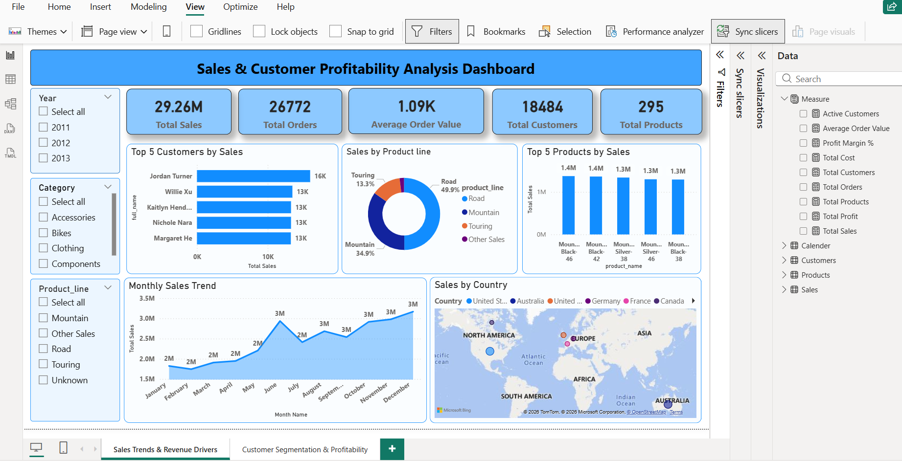
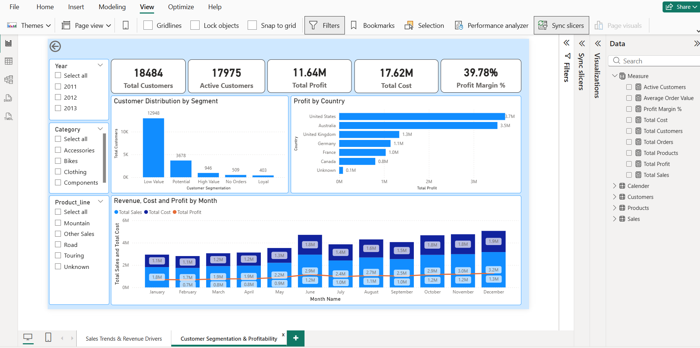

# Sales & Customer Profitability Analysis Dashboard

## Project Overview
This project analyzes sales data to identify key revenue drivers, regional performance trends, customer purchasing behavior and profitability.

## Objectives
- Identify top customers, products, and regions
- Analyze regional sales trends over time
- Understand customer purchasing behavior and segmentation
- Understand business profit country wise

## Tools Used
- SQL Server (Explored the data and performed major data cleaning, transformations)
- Power BI (Star Schema model, DAX, Data Visualization)
  
## Concepts
SQL
- Joins (Combined business data from multiple tables)
- Group By (Identified Top performers by sales)
- Sub queries (Dynamic results)
- Window functions (Ranked TOP5 customers, products)
- Views (Prepared the data for Power BI)
  
Power BI
- Data Understanding
- Data Cleaning
- Data Validation
- STAR Schema
- DAX
- KPI Design
- Visualization
- Business Analysis
  
## Dashboard Pages
1. Sales Trends and Revenue Drivers
2. Customer Segmentation and Profitability

## Key Insights
- United States and Australia are top revenue contributors
- No region shows consistent decline
- Majority customers are low-value, indicating lack of strong loyalty base
- United States and Australia are top profitable countries

## Business Impact
Enabled identification of revenue drivers, regional trends, customer behavior and Profitability to support data-driven decision making.

## GitHub repo structure 
- datasets/
- docs/
- images/
- powerbi/
- sql/
- README.md
